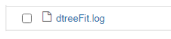
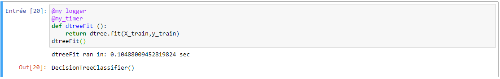

# Decision-Tree

## Binder Badge, um die Binder-Umgebung zu starten:
[](https://mybinder.org/v2/gh/AdilSh99/Decision_Tree_my_logger-my_timer/HEAD)

## Wie wird die Übung durchgeführt?
Klicken Sie auf die Schaltfläche "Launch Binder", dann wird ein Binder-Fenster geöffnet. Es wird automatisch ein Docker-Container mit allen notwendigen Images erstellt. Nach erfolgreicher Erstellung wird ein Jupyter-Fenster geöffnet. Öffnen Sie Decision_Trees_Projekt.ipynb und klicken Sie dann oben in Cell auf Run All.

## Erwartete Ergebnisse ?
Für dieses Projekt werden wir öffentlich verfügbare Daten von LendingClub.com verwenden. Wir werden Daten von 2007 bis 2010 verwenden, bevor das Unternehmen an die Börse ging. Anhand der Daten werden wir versuchen, vorherzusagen, ob ein Kreditnehmer das Geld zurückgezahlt hat oder nicht. Wir haben die Daten als CSV in der Kursdokumentation angehängt.

1. Daten lesen.
2. Explorative Datenanalyse von Daten.
3. Erzeugen einiger Visualisierungen für einen allgemeinen Überblick.
4. Vorbereiten von Daten für ein Random-Forest-Klassifikationsmodell.
5. Trainieren eines Entscheidungsbaummodells
6. Auswertung der Daten

## Timer & logger

In diesem Abschnitt werden wir dokumentieren, wie wir die Ausführungszeit für bestimmte Funktionen protokollieren und erhalten können.

Als Start müssen wir die notwendigen Wrapper Timer und Logger wie folgt einrichten

```python
# Decorators
from functools import wraps

def my_logger(orig_func):
    import logging
    logging.basicConfig(filename='{}.log'.format(orig_func.__name__), level=logging.INFO)

    @wraps(orig_func)
    def wrapper(*args, **kwargs):
        logging.info(
            'Ran with args: {}, and kwargs: {}'.format(args, kwargs))
        return orig_func(*args, **kwargs)

    return wrapper


def my_timer(orig_func):
    import time

    @wraps(orig_func)
    def wrapper(*args, **kwargs):
        t1 = time.time()
        result = orig_func(*args, **kwargs)
        t2 = time.time() - t1
        print('{} ran in: {} sec'.format(orig_func.__name__, t2))
        return result

    return wrapper
```

Als Nächstes müssen Sie diese Umhüllungen wie folgt verwenden:

```python
@my_logger 
@my_timer 
def dtreeFit ():
    return dtree.fit(X_train,y_train)
dtreeFit()
```

Und wie Sie sehen können, sind dies die Ausgaben nach der Ausführung:
- Logger


- Timer



## Unit Tests
Der erste Unit-Testfall liest seinen Testdatensatz aus der Datei test_data.txt.
Der Benutzer kann nun den Datensatz für diesen Test über eine der folgenden Methoden ändern:
```
Override the data set with new one in test_data.txt
Run unit tests
```
or
```
Remove test_data.txt 
Rename test_data2.txt to test_data.text
Run unit tests
```
